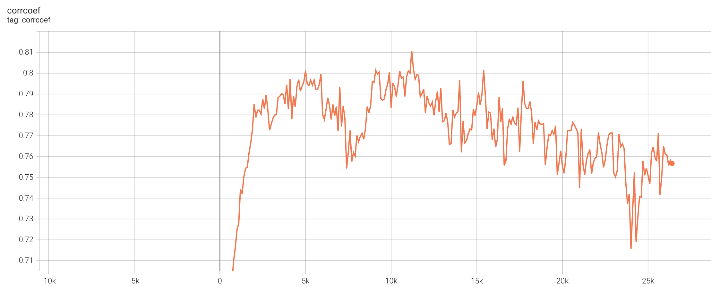
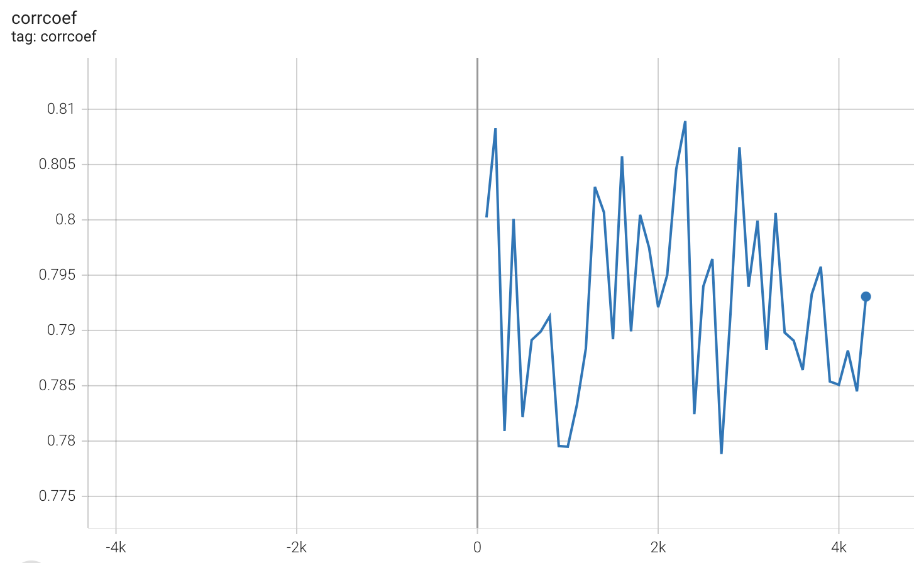

# SimCSE复现

## 项目描述
SimCSE是一种简单但是很巧妙的NLP对比学习方法，创新性地引入Dropout的方式，对样本添加噪声，从而达到对正样本增强的目的。
该框架的训练目的为：对于batch中的每个样本，拉近其与正样本之间的距离，拉远其与负样本之间的距离，使得模型能够在大规模无监督语料（也可以使用有监督的语料）中学习到文本相似关系。
详见论文：[Simple Contrastive Learning of Sentence Embeddings](https://arxiv.org/abs/2104.08821)
和[SimCSE官方代码仓库](https://github.com/princeton-nlp/SimCSE) 。

本项目使用pytorch+transformers复现了SimCSE论文中的有监督训练和无监督训练方法，并且在STS-B数据集上进行消融实验，评价指标为Spearman相关系数，预训练模型为Bert-base-uncased，
验证了SimCSE的有效性。在STS-B数据集上，有监督训练和无监督训练的复现效果如下表。

在无监督训练中，dropout=0.1时，复现效果比原文略差，但也比较接近。当dropout=0.2时，复现效果比原文略高。
但在有监督训练中，不知是否由于batch size过小（原论文使用512），复现效果与论文的效果相差较远，后续会进行排查。 

| |训练方法  | learning rate  | batch size|dropout|Spearman’s correlation |
|  ---- |  ----  | ----  |  ----  | ----  |  ----  |
| 原论文  | 无监督 |3e-5|64|0.1| 0.763|
| 复现  | 无监督 |3e-5|64|0.2| 0.771|
| 复现  | 无监督 |3e-5|64|0.1| 0.748|
| 原论文  | 有监督 |5e-5|512|0.1| 0.816|
|复现    |有监督| 5e-5  | 64 |0.1|0.764|


## 运行环境
python==3.6、transformers==3.1.0、torch==1.6.0


## 项目结构
- data：存放训练数据
    - stsbenchmark：STS-B数据集
        - sts-dev.csv：STS-B验证集
        - sts-test.csv：STS-B验测试集
    - nli_for_simcse.csv:数量275601为的NLI数据集
    - wiki1m_for_simcse.txt:维基百科上获取的100w的文本
- output:输出目录 
- pretrain_model：预训练模型存放位置
- script：脚本存放位置。
- dataset.py
- model.py：模型代码，包含有监督和无监督损失函数的计算方式
- train.py:训练代码


## 使用方法
### Quick Start
下载训练数据：
```
bash script/download_nli.sh
bash script/download_wiki.sh
```

无监督训练，运行脚本
```
bash script/run_unsup_train.sh
```
有监督训练，运行脚本
```
bash script/run_sup_train.sh
```

## 实验
### 无监督训练
从前四条实验数据中可以看到，较大的batch size在一定程度上可以增加模型的泛化性。

dropout为0.2的时候，训练效果比0.1与0.3更好，有可能dropout=0.1加入的噪声过小，而dropout=0.3加入的噪声过大，增强得到的样本与原始样本差异较大。

|  learning rate  | batch size  | dropout | 在哪一步得到best checkpoint|验证集上的得分| 测试集上的得分|
|  ----  | ----  |  ----  | ----  | ----  | ----  | 
| 3e-5  | 256 |0.1|6000|0.800|0.761|
| 3e-5  | 128 |0.1|4200|0.799|0.747|
| 3e-5  | 64 |0.1|10900|0.803|0.748|
| 3e-5  | 32 |0.1|21300|0.787|0.714|
| 3e-5  | 64 |0.2|11200|0.811|0.771|
| 3e-5  | 64 |0.3|6300|0.781|0.745|
| 1e-5  | 64 |0.1|16400|0.798|0.751|


### 有监督训练
有监督实验的复现结果未达到预期，超参数相同时，在验证集上的得分略高于无监督，但是在测试集上，得分基本没有差异。增大有监督训练的学习率，有监督的训练的得分略高于无监督训练，
但还是与论文声称的0.816相差较远，原论文使用512的batch size，
不知是否由于batch size的设置有关，后续会对有监督的训练代码进一步排查。

不过从训练曲线可以看到，有监督训练的收敛速度明显快于无监督训练，这也符合我们的认知。

|训练方法|  learning rate  | batch size  | dropout | 在哪一步得到best checkpoint|验证集上的得分| 测试集上的得分|
|  ----|  ----  | ----  |  ----  | ----  | ----  | ----  | 
|无监督| 3e-5  | 64 |0.1|10900|0.803|0.748|
|有监督| 3e-5  | 64 |0.1|200|0.810|0.748|
|有监督| 5e-5  | 64 |0.1|2300|0.809|0.764|
|有监督| 3e-5  | 32 |0.1|200|0.808|0.743|
|有监督| 5e-5  | 32 |0.1|200|0.806|0.746|

无监督训练过程中，验证集得分的变化曲线：


有监督训练过程中，验证集得分的变化曲线：


## REFERENCE
- https://arxiv.org/pdf/2104.08821.pdf
- https://github.com/princeton-nlp/SimCSE
- https://kexue.fm/archives/8348
- https://github.com/bojone/SimCSE

## TODO
- 排查有监督学习的效果不符合预期的原因


